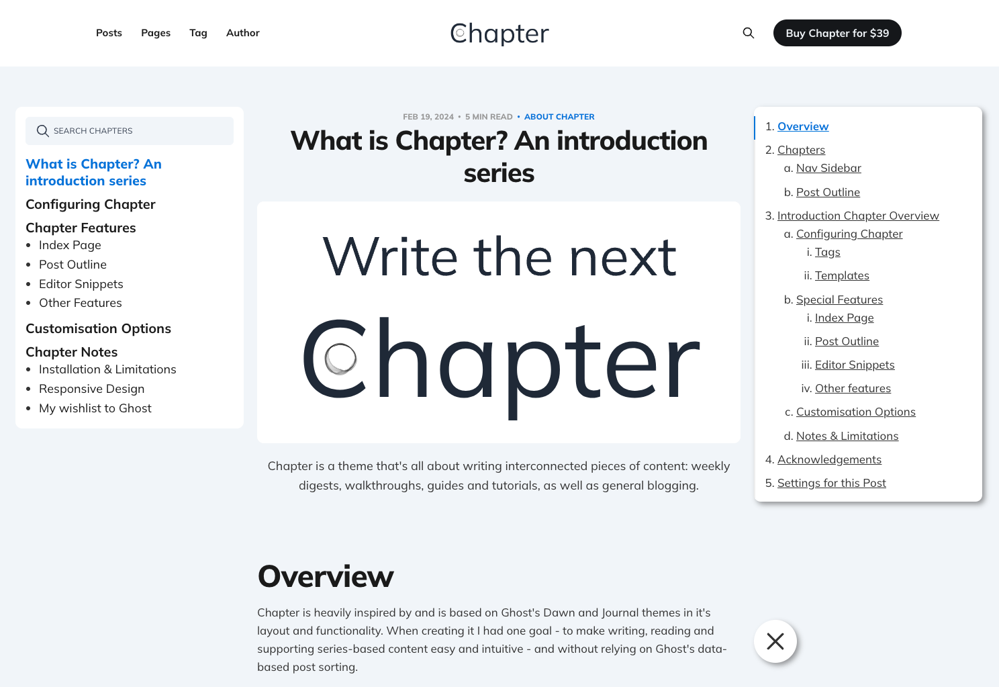

# Chapter

A combination of the highly functional Ghost [Dawn](https://github.com/tryghost/dawn) and quite well-structured [Journal](https://github.com/tryghost/journal) themes, that together adapt to the reader's preferences and allow for good structure.



**Demo**: <https://ghost-chapter.neveroff.dev/>

**Requires Ghost 6.0 or later**.

## Install or update the theme

1. Build or obtain `dist/chapter.zip` (see [Development](#development) below).
2. In Ghost Admin, go to **Settings → Design**.
3. Click the gear icon on the active theme → **Change theme** → **Upload theme**.
4. Select `chapter.zip` and activate it.

For a major Ghost upgrade (5.x → 6.x), update Ghost on your instance first, then upload Chapter **1.6.0** or newer. See [Upgrading from Ghost 5](#upgrading-from-ghost-5).

## Upgrading from Ghost 5

Chapter 1.6.0 requires Ghost 6. Upgrade your instance before uploading this theme.

**On your Ghost instance** (not in this repo):

1. Back up your database and `content/` directory.
2. Upgrade to the latest Ghost 5.x minor release, then to the latest Ghost 6.x. Ghost's [major version update guide](https://docs.ghost.org/update-major-version) covers the full sequence.
3. Ensure the host runs **Node.js 22** (Ghost 6 requirement).
4. Upload and activate Chapter 1.6.0+ from a fresh `pnpm run zip` build.

**Theme changes in 1.6.0 for Ghost 6:**

- Removed `limit="all"` from `{{#get}}` helpers (Ghost 6 caps API results at 100 items).
- Bumped `engines.ghost` to `>=6.0.0`.
- Uses Ghost 6 helpers: `comment_count`, `recommendations`.

**Known limits:** Ghost 6 caps each `{{#get}}` request at 100 items. Chapter nav uses two such queries: up to **100 order tags** (sections) and up to **100 posts per section**. Prev/next footer links depend on a complete `chapters[]` array built from those results — if either cap is hit, navigation may be incomplete. Serials with more than 100 sections or 100 posts in one section would need a Content API pagination approach; typical documentation sites stay well under both limits.

## Development

Styles are compiled using Gulp/PostCSS. You need **Node.js 22+** and [pnpm](https://pnpm.io/installation).

```bash
# Install dependencies
pnpm install

# Build assets and watch for changes
pnpm dev
```

For live preview against a local Ghost install, run these in separate terminals:

```bash
pnpm dev

# From your Ghost install directory
ghost run -D
```

Edit files under `assets/css/`; compiled output goes to `assets/built/`.

### Build a release zip

```bash
pnpm run zip
```

This writes `dist/chapter.zip` (and a versioned copy). Upload that file in Ghost Admin.

### Theme compatibility check

```bash
pnpm test
```

Runs [GScan](https://gscan.ghost.org/) against Ghost 6 rules.

## Theme structure

- **Core templates** (theme root): `default.hbs`, `index.hbs`, `page.hbs`, `post.hbs`, `tag.hbs`, `author.hbs`, plus custom templates (`custom-*.hbs`).
- **Partials** (`partials/`):
  - `base/` — content wrapper, post footer, comments, related posts
  - `chapter/` — chapters nav, sidebar, post cards, outline
  - `icons/` — SVG icons
  - `utility/` — srcset, meta tags, code/heading copiers
- **Assets** (`assets/`): source CSS/JS and Gulp-built `assets/built/`.

## Configuration

Theme settings are under **Settings → Design** (custom settings from `package.json` → `config.custom`): navigation layout, color scheme, showcase post, related posts, outline, attribution, and more.

### Chapters

Chapter posts use internal tags with the `hash-chapter-*` prefix. See the site docs (e.g. "Configuring Chapter") for the full tagging convention.

The sidebar chapter tree (`partials/chapter/chapters-nav.hbs`) fetches order tags and posts via `{{#get}}`, then builds a `chapters[]` array in the browser for prev/next links in the post footer. Both queries are capped at **100 items** (Ghost 6 maximum). Keep each serial under 100 sections and assign one post per order tag unless you accept the per-section cap.

### Table of contents

Tocbot is bundled via Gulp. Source paths in `gulpfile.js`:

```js
'node_modules/tocbot/dist/tocbot.js',
```

CSS import in `assets/css/screen.css`:

```css
@import "tocbot/dist/tocbot.css";
```

### Internal tags

When iterating internal tags with `{{#foreach}}` or `{{#get}}`, set `visibility="internal"` (or `visibility="all"` where appropriate).

## Copyright & License

Copyright (c) 2024-2026 Mike Neverov, neveroff.dev — Released under the [MIT license](LICENSE).

This theme includes code derived from [Dawn](https://github.com/TryGhost/Dawn) and [Journal](https://github.com/tryghost/journal); see [NOTICE.md](NOTICE.md).
